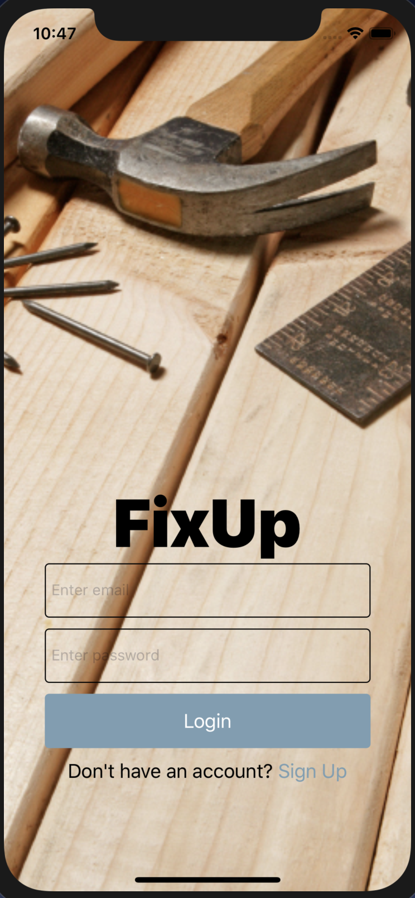
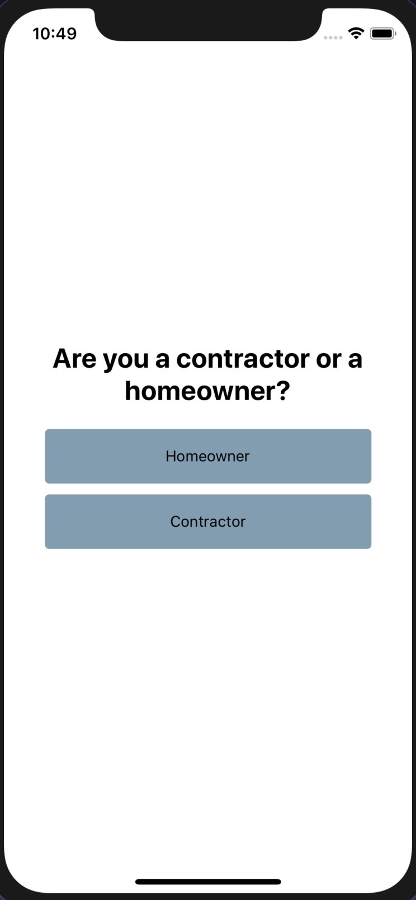
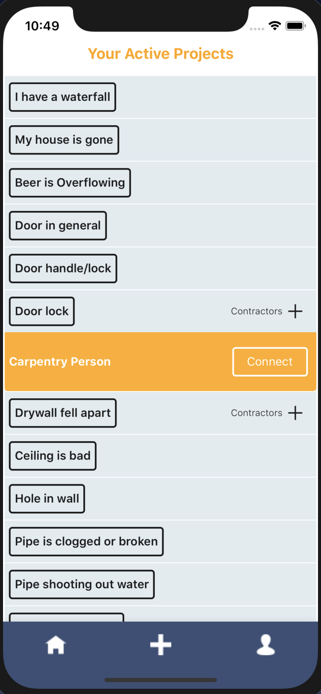
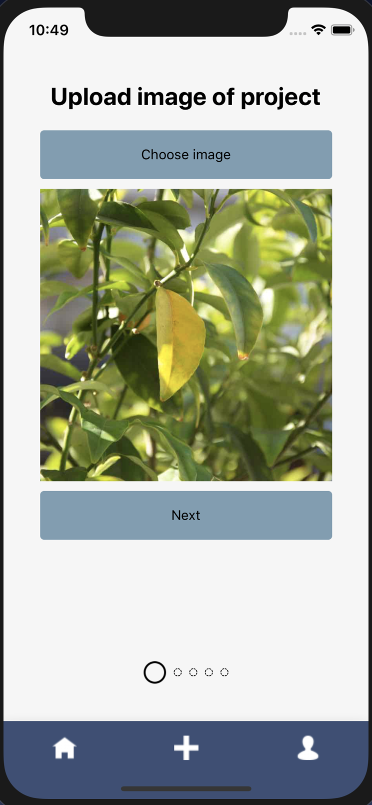
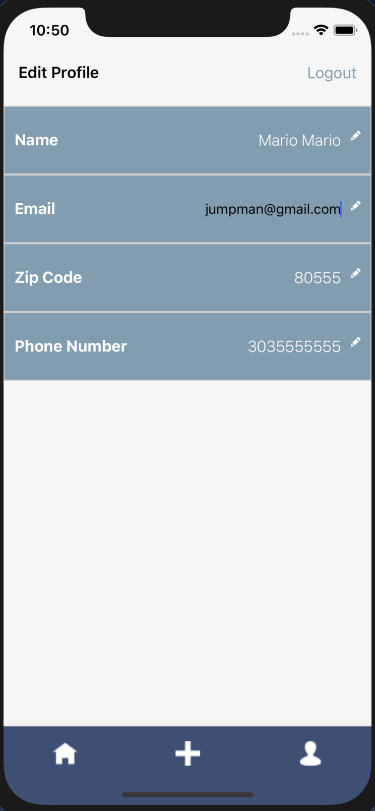
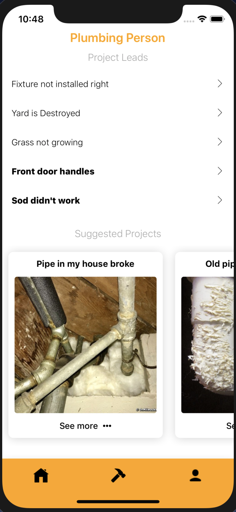
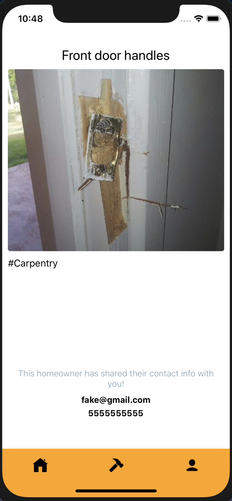
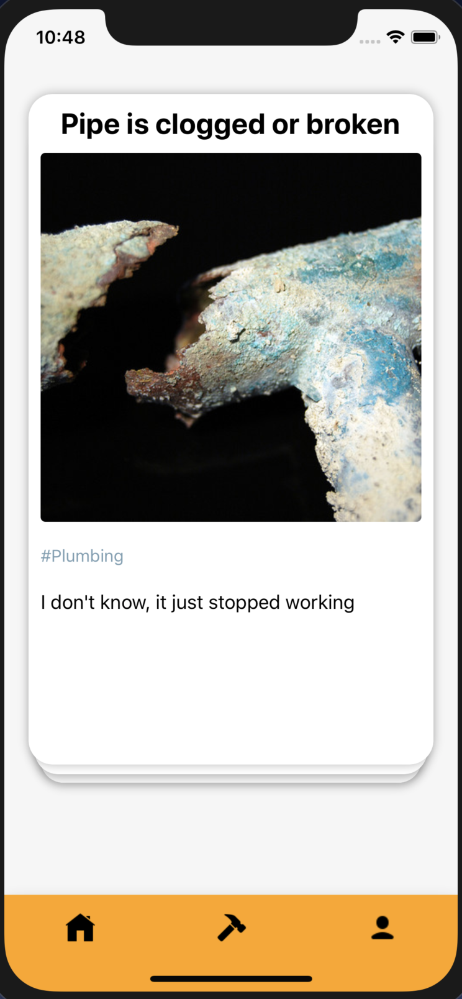
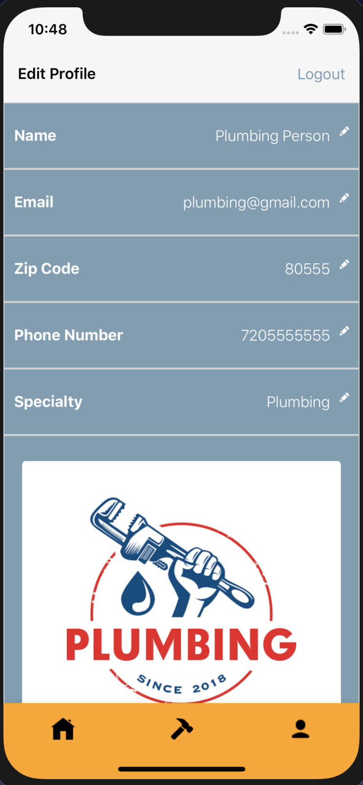

# FixUp

### Develpers

Front-End:
[Antonio Fry](https://github.com/AntonioFry)
[Steve Rumizen](https://github.com/rumizen)

Back-End:
[Trevor Nodland](https://github.com/tnodland)
[James Cape](https://github.com/james-cape)

[Back-End Repo](https://github.com/james-cape/fixup_backend)

## Installation

1. Clone down FixUp-fe repo
2. `npm install`
3. Login to Expo or sign up if you don't have an account
4. `npm start`
5. Run a mobile simulator or use Expo within your web browser

## [Production url](https://expo.io/@rumizen/FixUp)

## Summary
Many homeowners are lost when it comes to identifying the cause of a leak or knowing who to call for an electrical issue. It could take hours of emails, Google searches, and phone calls to even know what type of professional to hire. 

FixUp is an iOS and Android mobile app designed to help homeowners connect with contractors more easily. The app matches home projects with contractors of the right specialty to get everyone on the same page without any hassle.

  
  

### Homeowner

As a homeowner, FixUp provides a streamlined interface for posting projects and getting connected with an ideal contractor without having to spend time and effort. Simply take a photo of your issue, write a quick description of what you think is going on, and post your project in seconds. Then FixUp will show you all the contractors that have offered their services and you can choose the one you think is best. Once you hit "Connect", FixUp will automatically send your previously hidden contact info to that contractor to get the process started.

  
  
  
  

### Contractor

As a contractor, FixUp is an ideal way to book new clients and get your name out there. Once you've signed up, you can quickly browse potential jobs that align with your specialty. If a project looks like it's up your alley, simply swipe right to let that homeowner know you're interested in working with them. Then, that homeowner can look at your profile and your previous work and choose to send you their contact info. This provides a platform for finding work on the fly.

  
  
  
  

## Technologies

- React Native
- Jest
- Expo
- TravisCI
